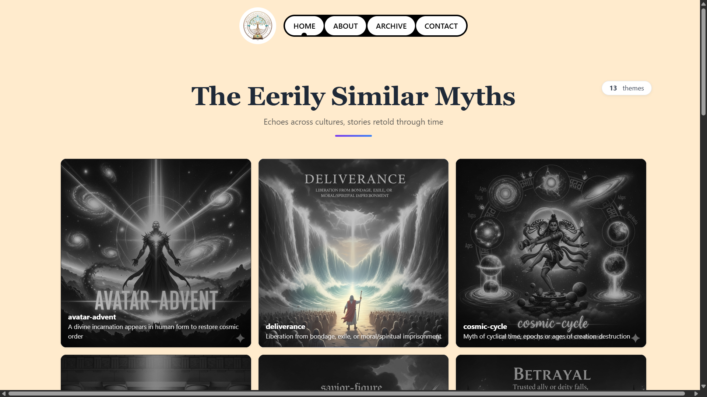
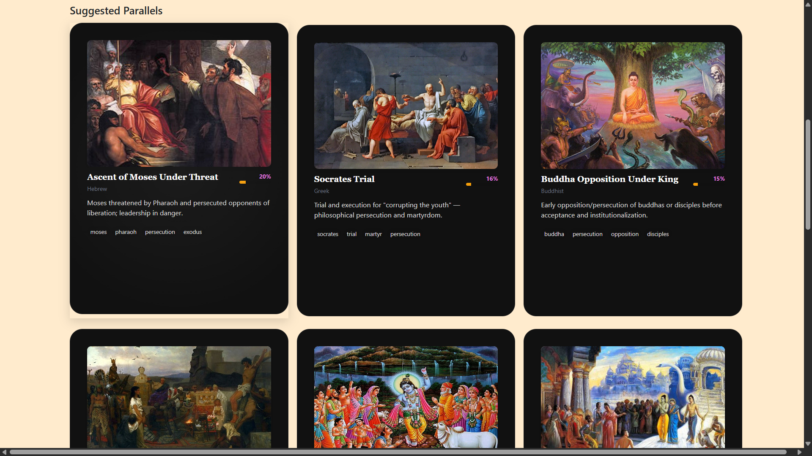
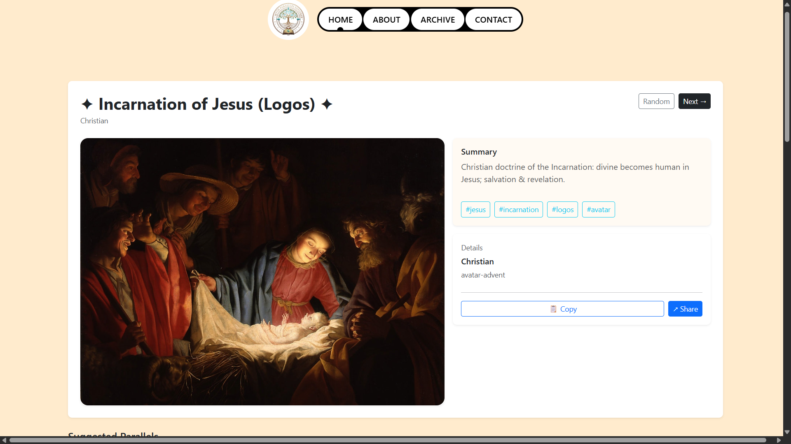
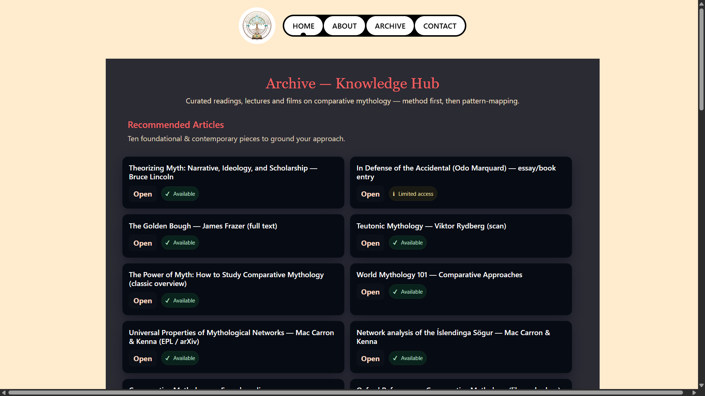

# Myth AI

> An AI-powered mythology research platform for exploring, comparing, and understanding myths across civilizations through explainable natural language processing.

<p align="center">
  
</p>

---

## 🏛️ Overview

Myth AI is a full-stack web application designed to explore and compare mythologies from cultures around the world. Built as a research-oriented platform, it combines human-curated mythology with explainable AI techniques to identify narrative similarities, recurring themes, and cross-cultural connections.

Using **TF-IDF** and **Cosine Similarity**, the platform analyzes mythological texts to suggest related stories while providing users with an intuitive interface for discovering myths, themes, and cultural traditions.

Whether you're a student, researcher, educator, or mythology enthusiast, Myth AI offers a modern and data-driven way to study the stories that have shaped civilizations.

---

## ✨ Highlights

- 🌍 Explore myths from civilizations around the world
- 🤖 AI-powered myth comparison using NLP
- 📖 Detailed mythology exploration pages
- 🧠 TF-IDF and Cosine Similarity recommendation engine
- 🔎 Discover recurring themes and narrative parallels
- 📚 Human-curated mythology database
- ⚡ Fast and responsive interface
- 📱 Fully responsive design
- 🎨 Clean and modern user experience
- 🚀 Cloud-based deployment

---

## 🚀 Tech Stack

| Category | Technologies |
|----------|--------------|
| Frontend | React |
| Backend | Node.js, Express.js |
| Database | PostgreSQL |
| NLP Engine | Natural (TF-IDF & Cosine Similarity) |
| Routing | React Router |
| Styling | Bootstrap 5, CSS3 |
| Deployment | Cloudflare Pages, Render |
| Language | JavaScript (ES6+) |

---

## 📂 Project Structure

```text
MythAI
├── backend
│   ├── routes
│   ├── controllers
│   ├── utils
│   └── server.js
├── frontend
│   ├── components
│   ├── pages
│   ├── utils
│   └── src
└── README.md
```

---

## ⚡ Getting Started

### Clone the repository

```bash
git clone https://github.com/sameer-khan-a/MythAI.git
```

### Navigate into the project

```bash
cd MythAI
```

### Install dependencies

```bash
npm install
```

### Start the development server

```bash
npx nodemon server.js

# or

node server.js
```

---

## 🌐 Live Demo

**Frontend:** https://mythai-byg.pages.dev/

**Backend API:** https://mythai-backend.onrender.com/

---

## 📸 Screenshots

### 🏠 Home


---

### 📖 Myth Explorer



---

### 🤖 AI Comparison


---

### 🌍 Theme Browser



---

### 📚 Myth Details



---

## 🛣️ Roadmap

- [x] Myth exploration platform
- [x] AI-powered similarity engine
- [x] TF-IDF & Cosine Similarity analysis
- [x] Responsive interface
- [x] Cloud deployment
- [ ] User authentication
- [ ] Research dashboards
- [ ] Advanced search filters
- [ ] Vector embeddings for semantic similarity
- [ ] User-contributed mythology database
- [ ] Bookmark and save myths

---

## 💡 Why Myth AI?

Most mythology websites function as digital encyclopedias, presenting stories in isolation. **Myth AI** takes a different approach by combining mythology with natural language processing to uncover relationships between narratives across cultures.

By leveraging explainable AI techniques alongside curated historical content, the platform enables users to discover recurring archetypes, shared motifs, and cultural parallels through an interactive and research-focused experience.

---

## 🤝 Contributing

Contributions, suggestions, and improvements are welcome.

1. Fork the repository.
2. Create a new feature branch.
3. Commit your changes.
4. Open a Pull Request.

---

## 👨‍💻 Author

**Sameer Khan**

If you found this project interesting, consider giving it a ⭐ to support its development.
